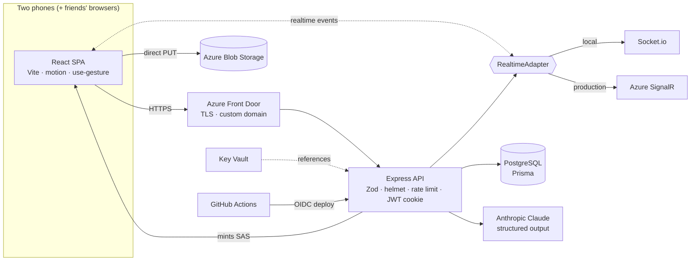

# Before We Were Three

A private, two-phone web app I built for my partner and me to use on our babymoon — the last trip
before our first child arrived. It's a deck of sealed "envelopes", each hiding a small shared
activity: an AI baby-name game, would-you-rather, trivia, letters to the baby, photo prompts, and a
gender reveal that only unlocks when both of us enter our keys. Friends could log in separately
to write letters we'd open on the trip, and at the end the whole thing exports as a keepsake.

It was designed, built and deployed to Azure in about three weeks, against a hard deadline: the
day we left.

**TypeScript · React 18 · Vite · Node/Express · PostgreSQL + Prisma · Socket.io / Azure SignalR ·
Anthropic Claude API · Azure (App Service, Front Door, Key Vault, Blob Storage, Flexible Server) ·
GitHub Actions (OIDC) · Jest · Vitest · React Testing Library**

---

## What it does

| Activity | What's interesting under the hood |
| --- | --- |
| **Envelope deck** | One `BaseEnvelope` owns every visual state (sealed → opening → open → completed), the flap animation, haptics and status persistence. Each activity is a child component plugged into it — seven activities, one envelope. Swipe-to-navigate pile with spring physics. |
| **Baby Name Game** | Claude generates rounds of names from a locked [prompt contract](docs/babymoon_portal_feature_blueprint.md#10-ai-baby-name-game--prompt-contract-locked) plus per-round guidance from each partner. Responses are constrained with JSON-schema structured output, never repeat earlier names, and are voted Love / Maybe / Nope on each phone independently; matches are computed when both finish. |
| **Would You Rather** | Both phones vote in real time; neither sees the other's answer until both have locked in. |
| **Gender Reveal** | The one real secret in the app. A trusted friend sets the value; the admin never sees it. Each partner holds a key; keys are stored as salted **scrypt** hashes and checked with `timingSafeEqual` inside a **Serializable** transaction, and the value is released to the client only after both validate. |
| **Letters & photo prompts** | Auto-saving drafts, photo attachments uploaded **directly from the browser to Azure Blob Storage** with 10-minute write-only SAS URLs (XHR for real upload progress), and a shared media library. |
| **Friend letters** | Friends get their own PINs and a separate dashboard to write letters to either of us or the baby. These survive the admin's "reset session" by design. |
| **Keepsake export** | Everything the trip produced — letters, votes, name matches, photos — rendered to a standalone HTML keepsake bundled as a zip, with HEIC and other non-browser formats converted to JPEG server-side by `sharp`, behind a size gate. |

## Architecture



The code is a three-package npm workspace:

```
client/   React SPA — components/{common,envelope,activities}, one custom hook per domain
server/   Express API — routes → services → typed Prisma queries; SQL migrations
shared/   API contracts and Zod schemas imported by both sides
```

## Engineering highlights

- **Two devices, one experience.** Real-time is behind a `RealtimeAdapter` interface
  ([`realtime.ts`](server/src/services/realtime.ts)) with Socket.io and Azure SignalR
  implementations, so local development needs no cloud services and production gets a managed
  hub. Socket handshakes are authenticated from the same JWT session cookie as the REST API.
- **Correct under concurrency.** Every "count, decide, create" path — both partners finishing a
  vote round at the same moment, both keys arriving together — runs in a `Serializable`
  transaction, because `READ COMMITTED` let both requests see the same count.
- **One contract, both sides.** Request and response types live in [`shared/`](shared/types)
  with Zod schemas; every endpoint returns `{ success, data }` or `{ success, error: { code, message } }`.
- **Security that fits the threat model.** PIN-gated access with constant-time comparison and
  rate limiting, `httpOnly` / `sameSite=strict` JWT sessions, a strict CSP via helmet, secrets from
  Key Vault references, and keyless GitHub → Azure deploys via OIDC. See [SECURITY.md](SECURITY.md).
- **Resettable by design.** An admin "Reset Session" wipes user-generated state in FK-safe order
  inside one transaction while preserving admin-authored content and friends' letters — which
  made rehearsing the whole trip end-to-end possible.
- **Tested.** ~650 test cases across 48 files: Jest + Supertest for routes and services, Vitest +
  React Testing Library for hooks and components. Lint, build and tests gate every push in CI.

## How it was built

This was also an experiment in building fast with AI coding agents without letting quality slip.

- **Spec first.** A [feature blueprint](docs/babymoon_portal_feature_blueprint.md),
  [design foundation](docs/babymoon_design_foundation.md) ("Golden Hour Intimacy": Fraunces +
  Source Sans 3, warm tokens, 44 px touch targets) and [technical patterns](docs/bwwt_technical_patterns.md)
  doc came before any code.
- **Phased, deployable checkpoints.** The [roadmap](.planning/ROADMAP.md) ran seven phases —
  infrastructure, envelopes, real-time, letters & media, the AI name game, trivia, the reveal —
  each with its own research, plans, verification and lessons learned under
  [`.planning/phases/`](.planning/phases), and ended at a working, deployed checkpoint before
  the next layer went on top.
- **An agent team with defined roles.** [`agents/`](agents) defines a spec clarifier, researcher,
  implementer, tester, reviewer, documenter and debugger, orchestrated by
  [`scripts/`](scripts). A whole-codebase review pass ([`output/codebase-review/`](output/codebase-review))
  found and fixed race conditions, PIN-timing issues and duplicated logic in waves.
- **Lessons captured as rules.** Bugs that bit once — StrictMode double-mounting a `mountedRef`,
  Prisma's Windows file lock, a missing CSP `connect-src` silently breaking uploads — became
  permanent entries in [`CLAUDE.md`](CLAUDE.md) so they couldn't recur.

## Running it locally

Requires Node 22+ and PostgreSQL.

```bash
npm install
cp .env.example server/.env        # set DATABASE_URL and JWT_SECRET at minimum
npm run db:migrate --workspace=server
npm run dev:all                      # API on :3000, client on :5173
```

Without Azure Storage or Anthropic keys the app still runs; photo upload and name generation
report that they're unavailable. `npm test` runs all suites, `npm run lint` runs ESLint.

## License

[MIT](LICENSE)
